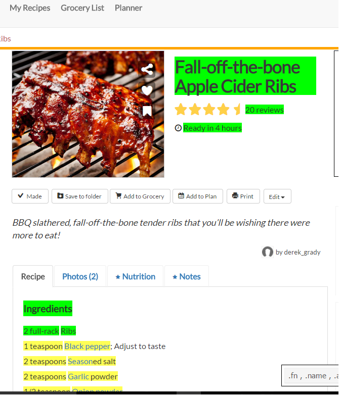
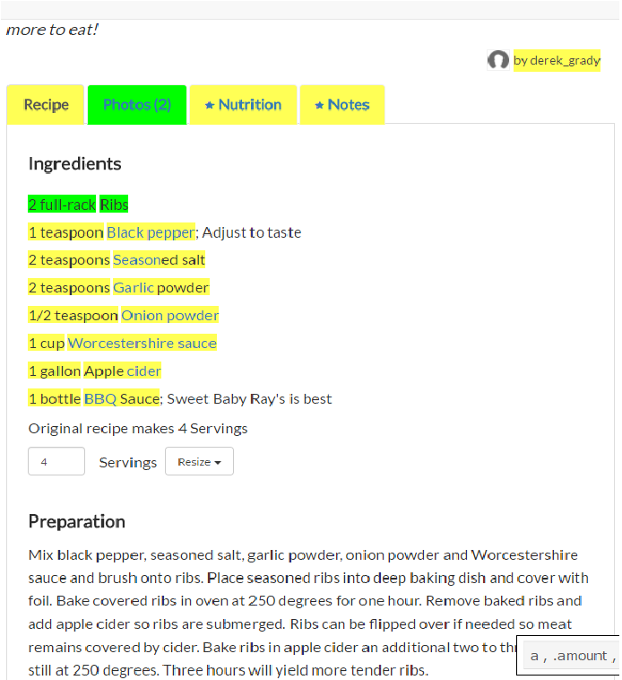
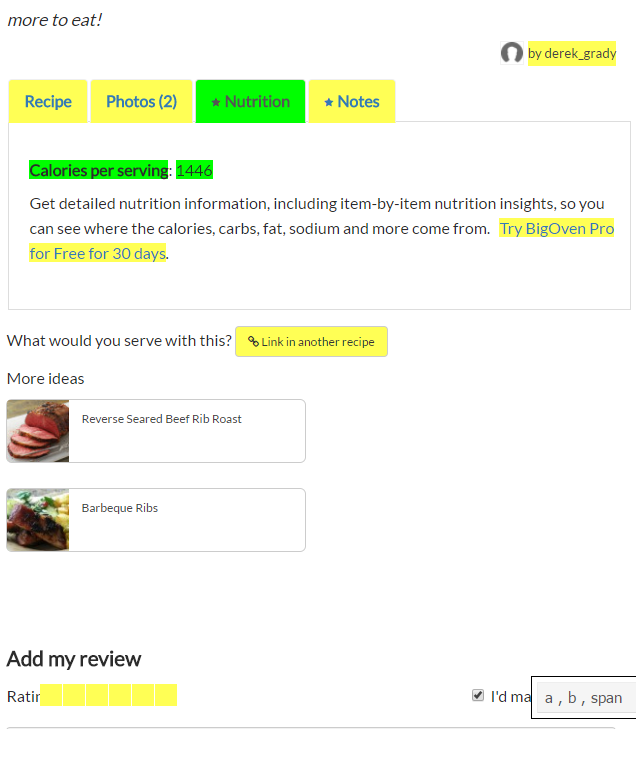

# Recipe Analysis using Machine Learning Method
1. [Collected recipe data from website bigOven.com.](README.md#Grab-recipe-data-&-clean-data)
2. [Explore ingredients in recipes.](README.md#Network)
3. [Analyze recipe rating.](README.md#Random-Forest)
4. [To do in future](README.md#to-do-in-future)

# Grab recipe data & clean data
Collected recipes data from bigOven.com. The recipe information includes the following.

|name     |category|duration_cook| calorie|review| rating|photo numbers| serving_num    |all ingredients & amount| 
|---------|-----------|---------|-----------|---------|-----------|---------|-----------|----|

Below are some screenshots of the recipe webpage.

### Screen shots of recipe web page


I wrote several R functions to visit each recipe webpage, download the text, extract the information that I need, clean the data and store them in a data frame for further exploration.

```{r, warning= F, message=FALSE}
library(rvest) # Grab data from web
source("get_links.R") # get links function
source("modify_url_table.R") # modify url_table, add '?page=6' to visit more webpages
source("get_recipe.R") # get recipe from one url
source("get_all_recipes.R") # get recipe form a table of urls, return a list of recipe
source("convert_to_df.R") # convert recipe_list to a data frame
```
Below is an example of the data after extraction and data cleaning.

### Table 1

|name|category|duration_cook| calorie_per_serving |review| rating|photo numbers| serving_num     |Ribs| Black pepper |salt  | Garlic |...... |
|---------|-----------|---------|-----------|---------|-----------|---------|-----------|---------|-----------|---------|------|------|
|Apple Cider Ribs | Ribs  |4| 1446 |20| 4.5|2| 4     |2     | 1 |1     | 2  | ......|

### Data frame dimension

|Number of Recipes  | Number of Ingredients |
|--------------|--------------------|
|6720  | 593|

# Network: explore relations of ingredients
Present the relations of ingredients in network graphs. Each ingredient is a vertice in the network.
Go through each recipe, connect all ingredients that appears in one recipe and increase the weight of links between them by 1. The picture below shows the network of all ingredients.

||
|:----------:|
|Image 1: Network of all ingredients|

As we can see in above graph, there are too many vertices and links in the network. Let's reduce the complexity of network, so we can see some meaningful relations between ingredients. Therefore, I deleted all links with weight less than 5, so we get the graph below.

||
|:----------:|
|Image 2: Network after deleting links with small weight|

Since some links are deleted, some vertices are isolated. In the connected graph, there are some large dots. They are some very commen ingredients. For example,

### Commen ingredients; to be deleted

|salt     | onion     |garlic   | pepper     |olive.oil     | black.pepper     |butter     | tomatoes     | ......|
|---------|-----------|---------|-----------|---------|-----------|---------|-----------|-----|

Let's also delete them, since they doesn't provide much infrmation. Then we get the graph below.

||
|:----------:|
|Image 3: Network after deleting commen ingredients and isolate vertices|


| **ID**     | 150     |50   | 31     |55    | 48     |61     | 66     | ......|
|---------|-----------|---------|-------|---------|-----------|---------|-------|----|
|**INGREDIENT** | parsley |thyme   | sugar  |parmesan   | milk    |egg     | basil  |......|

The size of the vertices represents the degree. So a large vertice means that the ingredient appears very frequently in recipes. The thickness of the lines represents the weights. So a thick line means the 2 ingredients appears very frequently in one recipe. For example, we can see parsley(150) and basil(66) are popular ingredients and always appear in one recipe.


# Lasso: analyze rating of recipes

To figure out what makes a high rating for recipe, I used lasso regression to explain rating variable using all other variables. Used cross validations to figure out the best penlty coefficient lambda. I got non-zero coefficients on the following variables. I got mean squre error of predicting rating on testing data,  **0.36111** . 

### Variables with non-zero coefficients

| category    | review     |rosemary   | olive oil     |milk    | spaghetti.sauce       | ......|
|---------|-----------|---------|-------|---------|-----------|---------|
| 0.0061786124  | 0.0049001031 |0.0108121892 | 0.0091707927  |-0.0094320080    | -0.0059373417   | ......|

||
|:----------:|
|Image 4: Lasso|

# Random Forest: analyze rating of recipes
Used Random Forest to predict rating.  Mean Squre Error of predicting rating on testing data,  **0.30715**, which is **15%** better than Lasso method.


# To do in future
### Create a new recipe using Network
Start from one ingredient, then go to the next ingredient that has strongest connection with the original one; repeat the process until we get enough ingredients for one dish.  For example,

| egg | -> | milk | -> | parmesan | ->| basil| ->| parsley| ->| mushrooms|->| white wine|
|-----|-----|-----|----|----------|---|-----|----|---------|--|----------|---|--------|

My breakfast tomorrow!
### Recommendation of recipe to customers
Collect customers favourite recipe, compare it with all recipes in the database and find closet one as the recommendation.
